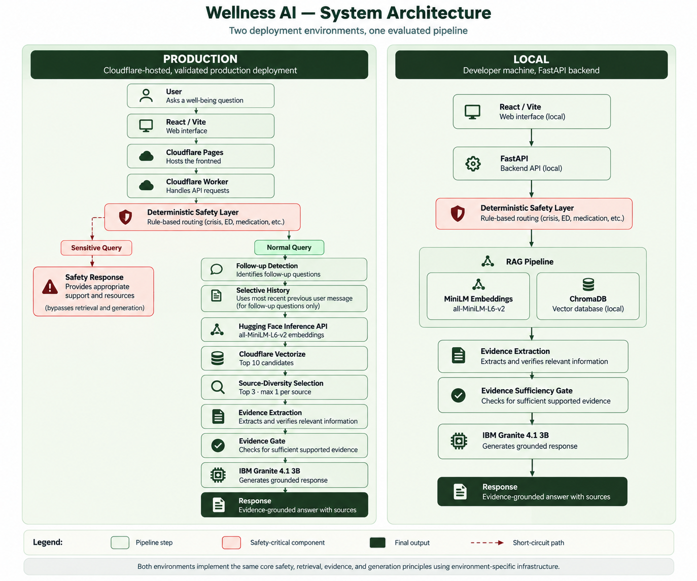
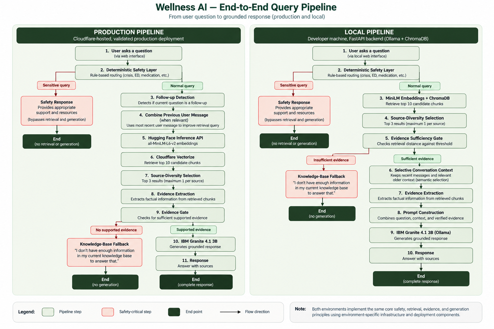
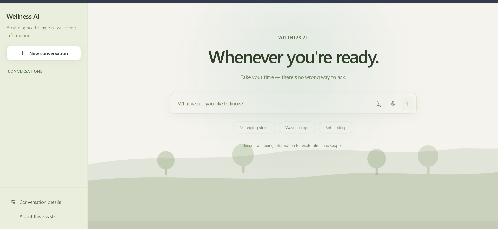
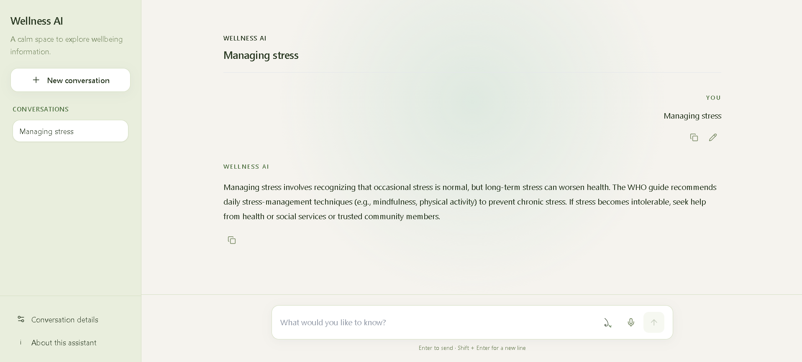
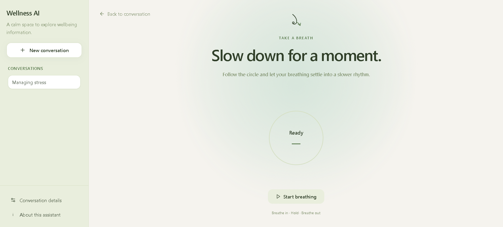
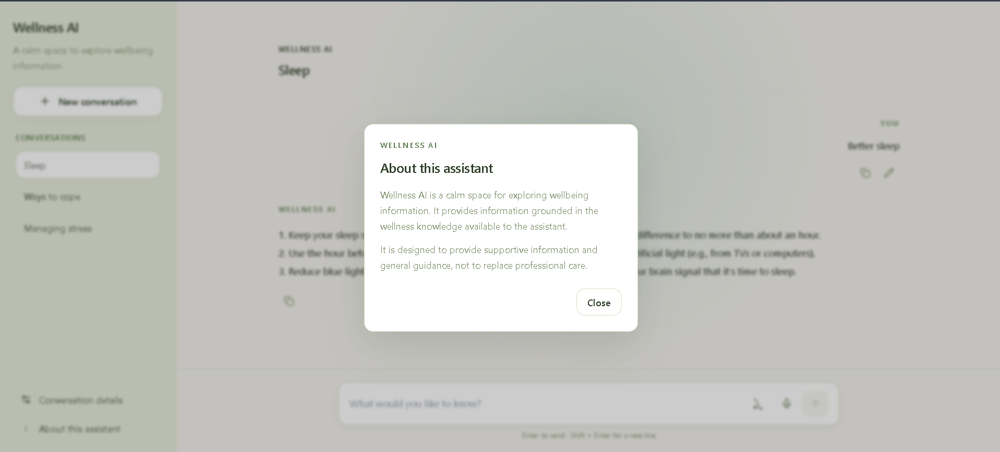

# Wellness AI

> **A Safety-Aware, Evidence-Grounded AI Assistant for Mental Well-Being**

Wellness AI is a responsible AI prototype designed to make general well-being information more accessible, understandable, and evidence-grounded.

It combines **Retrieval-Augmented Generation (RAG)**, **deterministic safety routing**, **evidence extraction**, **conversational memory**, and **IBM Granite 4.1 3B** in a full-stack web application.

> **Important:** Wellness AI is an informational/supportive prototype. It is not a medical diagnostic system, therapist, or emergency service.

---

## ?? SDG Alignment

**Primary SDG: SDG 3 — Good Health and Well-Being**

The project explores how responsible AI can support access to understandable general well-being information while incorporating safety and evidence-grounding mechanisms.

---

## ?? Problem

People increasingly use online sources and generative AI for information about stress, emotional well-being, and everyday health concerns.

However, general-purpose AI systems can produce fluent but unsupported responses and may not reliably handle sensitive situations.

Wellness AI addresses this challenge by combining:

* Evidence retrieval
* Evidence extraction
* Grounded generation
* Deterministic safety routing
* Selective conversational history
* Controlled evaluation

Rather than relying solely on free-form generation, the system separates safety decisions, retrieval, evidence processing, and response generation into distinct stages.

---

## ?? Solution

Wellness AI follows a controlled pipeline:

1. A user submits a question through the web interface.
2. A **deterministic safety layer** checks for sensitive scenarios.
3. Safe/normal queries enter the retrieval pipeline.
4. Relevant information is retrieved from a curated knowledge base.
5. Evidence is extracted and prepared for generation.
6. An evidence gate determines whether sufficient supported information is available.
7. **IBM Granite 4.1 3B** generates the response using the permitted context.
8. For detected follow-up questions, the most recent previous user message is combined with the current question to improve retrieval context.

This architecture is designed to reduce unsupported generation while preserving useful conversational context.

---

## ?? How It Works

### System Architecture



The production deployment runs through Cloudflare Pages and a Cloudflare Worker, while local development uses a FastAPI backend and ChromaDB. Both environments implement the same core safety, retrieval, evidence, and generation principles using environment-specific infrastructure.

### End-to-End Query Pipeline



The pipeline separates safety routing, retrieval, evidence validation, and generation. Sensitive queries and queries without sufficient supported evidence can terminate before generation.

## ?? Retrieval

The retrieval pipeline was evaluated experimentally rather than configured only through intuition.

### Configuration

* **Embedding model:** `sentence-transformers/all-MiniLM-L6-v2`
* **Vector database:** ChromaDB locally / Cloudflare Vectorize in production
* **Candidate pool:** 10
* **Final context:** 3 chunks
* **Maximum chunks per source:** 1
* **Similarity metric:** cosine

### Final Retrieval Results

| Metric          |    Result |
| --------------- | --------: |
| Top-1 retrieval | **67.5%** |
| Top-3 retrieval | **97.5%** |

The source-diversity constraint improved Top-3 retrieval from **90.0% to 97.5%** without changing Top-1 performance.

This configuration was retained because the experiments showed a measurable improvement in evidence coverage without unnecessarily increasing the context size.

---

## ?? Conversational Memory

Wellness AI does not blindly send the entire conversation history to retrieval.

Instead, it uses **selective history** so that previous turns are incorporated when they are useful for interpreting the current question.

For example:

```text
User: How can I manage daily stress?

User: What should I try first?
```

The second question can depend on the meaning established by the first turn.

### Evaluation

| Retrieval Strategy     |     Top-1 |    Top-3 |
| ---------------------- | --------: | -------: |
| Current question only  |     43.8% |    62.5% |
| Always include history |     62.5% |    75.0% |
| **Selective history**  | **75.0%** | **100%** |

Selective history improved retrieval over the current-question-only baseline by:

* **+31.2 percentage points Top-1**
* **+37.5 percentage points Top-3**

The evaluation also showed that indiscriminately including older history could introduce regression, which motivated the selective approach.

---

## ??? Safety Architecture

Safety decisions are separated from normal generative processing.

The system uses deterministic routing for sensitive categories including:

* Crisis-related situations
* Medication-related queries
* Restrictive/eating-related queries
* Diagnostic uncertainty

The safety layer operates before normal retrieval and generation for applicable sensitive scenarios.

### Safety Evaluation

The local deterministic safety suite achieved:

**12/12 tests passed.**

Production testing additionally covered crisis, medication-restriction, restrictive-eating, normal well-being, unsupported requests, and topic-switching scenarios.

Safety decisions are based on the current user question rather than allowing unrelated historical context to override the current safety intent.

---

## ?? Evidence & Grounding

A central design goal of Wellness AI is to reduce unsupported claims.

The generation pipeline separates retrieval, evidence validation, evidence extraction, and final response generation. Retrieval sufficiency is checked before generation, and evidence extraction provides a structured basis for supported claims. If sufficient supported evidence is not available, the system can terminate before generation rather than forcing an unsupported answer.

The final frozen generation evaluation achieved:

**18/20 successful evaluations — 90%.**

Among applicable grounding cases:

**15/16 were grounded — 93.75%.**

Two evaluations contained unsupported claims and were retained as known limitations rather than being hidden from the evaluation record.

---

## ? Key Features

* Evidence-grounded conversational responses
* Retrieval-Augmented Generation
* Deterministic safety routing
* Evidence extraction before generation
* Evidence gating
* Selective conversational history
* Follow-up question detection
* New conversations
* Conversation history
* Rename, pin, archive, and delete conversations
* Retry behavior
* Responsive React interface
* Guided breathing exercise
* FastAPI local backend
* Cloudflare Worker production API
* ChromaDB local retrieval
* Cloudflare Vectorize production retrieval

---

## ?? AI Technologies

| Technology                           | Role                                             |
| ------------------------------------ | ------------------------------------------------ |
| **IBM Granite 4.1 3B**               | Response generation and evidence processing      |
| **Retrieval-Augmented Generation**   | Grounds responses in retrieved information       |
| **Sentence Transformers**            | Semantic embeddings                              |
| **ChromaDB**                         | Local vector database                            |
| **Cloudflare Vectorize**             | Production vector database                       |
| **Deterministic Safety Layer**       | Routes sensitive scenarios                       |
| **Evidence Extraction**              | Converts retrieved material into usable evidence |
| **Selective Conversational History** | Preserves useful multi-turn context              |
| **Follow-up Detection**              | Identifies context-dependent questions           |

---

## ?? Experiment-Driven Development

The system was developed through controlled experiments rather than continuously changing the pipeline without measurement.

Major experiments included:

* Retrieval model and configuration comparisons
* Candidate-pool and Top-K evaluation
* Source-diversity constraints
* Evidence extraction strategies
* Generation interventions
* Safety routing coverage
* Follow-up detection
* Selective versus always-on conversation history
* Production/local retrieval parity
* End-to-end production validation

Interventions that did not provide sufficient evidence of improvement were rejected or archived.

This helped maintain a controlled and reproducible system while preserving historical evaluation results.

---

## ?? Final Evaluation

The final evaluation covered retrieval, safety, generation, conversation behavior, and production end-to-end behavior.

### Evaluation Methodology

The evaluation methodology, benchmark structure, metrics, and interpretation rules are documented separately.

[Read the full Evaluation Methodology](docs/evaluation/evaluation_methodology.md)

### Retrieval

* **Top-1:** 67.5%
* **Top-3:** 97.5%
* **Candidate pool:** 10
* **Final context:** 3 chunks
* **Maximum chunks per source:** 1

### Safety

* **Local deterministic safety suite:** 12/12 PASS
* Production safety scenarios validated across crisis, medication, restrictive-eating, and normal queries.

### Generation

* **18/20 successful evaluations**
* **90% final generation success**
* **20/20 appropriate tone**
* **20/20 diagnostic-label avoidance**

### Grounding

* **15/16 applicable evaluations grounded**
* **93.75% applicable grounding**

Two unsupported-claim failures remained and are documented as known limitations.

### Follow-Up Detection

* **92% overall**
* **100% follow-up detection** on the final follow-up subset
* **100% standalone detection**
* **100% ambiguous-case detection**

### Selective History

* **75.0% Top-1**
* **100% Top-3**
* **+31.2 pp Top-1** over current-only history
* **+37.5 pp Top-3** over current-only history

### Production End-to-End

Final production testing produced:

**11/12 clean PASS + 1 known limitation**

The known limitation involved a context-dependent follow-up that could return `NO_SUPPORTED_EVIDENCE` even when the conversation context was useful.

The evidence gate was intentionally not weakened to force an answer without sufficient retrieved evidence.

> These are internal prototype evaluation results. They do not represent clinical validation, medical accuracy certification, or real-world health outcomes.

---

## ?? Evaluation Philosophy

The project preserves historical evaluation results rather than rewriting earlier benchmarks after later improvements.

When an issue is discovered after an evaluation freeze:

```text
Identify
   ?
Classify
   ?
Track in owning phase
   ?
Finish current phase
   ?
Return to owning phase
   ?
Resolve
   ?
Re-test
   ?
Re-freeze
   ?
Final acceptance
```

This allows the project to distinguish between:

* **Frozen historical results**
* **Post-freeze fixes**
* **Current final behavior**

This distinction is important for maintaining reproducibility and honest reporting.

---

## ??? Responsible AI

Wellness AI was designed with responsible AI considerations as core engineering requirements.

### Safety

Sensitive scenarios are handled through deterministic routing before normal generative processing.

### Transparency

The retrieval, evidence extraction, and evidence-gating stages provide mechanisms for grounding responses in retrieved information.

### Fairness

The system is designed to avoid demographic assumptions and discriminatory responses.

### Privacy

The prototype avoids unnecessary collection of personal or sensitive information.

### Human Oversight

Wellness AI is designed as an informational/supportive system rather than an autonomous medical decision-maker.

### Limitations

The system should not be treated as a replacement for qualified medical, psychological, or emergency support.

---

## ?? Known Limitations

The project has several known limitations that remain important for future development.

### 1. Retrieval Top-1 Performance

Top-1 retrieval accuracy is **67.5%**, while Top-3 reaches **97.5%**.

This indicates that the correct evidence is usually present within the candidate context, but the highest-ranked result is not always the best individual source.

### 2. Follow-Up Evidence-Gate Limitation

Some context-dependent follow-up questions may return:

```text
NO_SUPPORTED_EVIDENCE
```

even when the conversation context provides useful meaning.

The current evidence gate was deliberately not weakened to force an answer without sufficient retrieved evidence.

### 3. Unsupported Generation Claims

Two final-generation evaluations contained unsupported claims.

These remain documented as generation/grounding limitations rather than being removed from the evaluation set.

### 4. Safety Coverage

The established deterministic safety suite passed 12/12 cases. During the Phase 7 release audit, an additional restrictive-eating paraphrase gap was identified outside that frozen benchmark, fixed in the safety routing implementation, and covered by additional regression tests (local 8/8 restrictive/eating detection; production safety 17/17; full Worker suite 26/26). Broader paraphrase and adversarial testing remains a general future evaluation area.

### 5. Knowledge Base Dependence

Response quality depends partly on the quality, coverage, and diversity of the underlying knowledge base.

### 6. Prototype Scope

The system has not undergone clinical validation or large-scale real-world user testing.

---

## ??? Screenshots

### Main Interface



### AI Conversation



### Breathing Exercise



### Responsible Use / About Assistant



---

## ??? Project Structure

```text
PROJECT/
¦
+-- Archive/
+-- data/
¦   +-- eval/
+-- deployment_experiments/
+-- docs/
+-- Evaluation/
+-- Tests/
+-- Tools/
¦
+-- cloudflare-deployment/
¦   +-- src/
¦   ¦   +-- evidence.ts
¦   ¦   +-- generation.ts
¦   ¦   +-- grounding.ts
¦   ¦   +-- index.ts
¦   ¦   +-- retrieval.ts
¦   ¦   +-- safety.ts
¦   +-- test/
¦   +-- tests/
¦   +-- wrangler.jsonc
¦
+-- wellness_ai_frontend_phase3B/
¦   +-- wellness_ai_frontend/
¦
+-- api.py
+-- query_pipeline.py
+-- rag_config.py
+-- safety_layer.py
+-- requirements.txt
+-- requirements.freeze.txt
```

Evaluation artifacts and archived experiments are kept separate from active application code.

---

## ?? Local Setup

### Requirements

* Python 3.14+
* Node.js / npm
* Ollama
* IBM Granite 4.1 3B
* Project dependencies from `requirements.txt`

### 1. Install Python Dependencies

```powershell
pip install -r requirements.txt
```

### 2. Start Ollama

Make sure Ollama is installed and the required model is available:

```powershell
ollama list
```

The project currently uses:

```text
granite4.1:3b
```

### 3. Start the FastAPI Backend

From the project root:

```powershell
python -m uvicorn api:app --host 127.0.0.1 --port 8000
```

### 4. Start the Frontend

```powershell
cd wellness_ai_frontend_phase3B\wellness_ai_frontend

npm install
npm run dev
```

For local development, configure:

```text
VITE_API_BASE_URL=http://127.0.0.1:8000
```

Production configuration is kept outside the public repository.

---

## ?? Production Deployment

The production implementation uses Cloudflare:

| Component         | Technology           |
| ----------------- | -------------------- |
| Frontend          | Cloudflare Pages     |
| API               | Cloudflare Workers   |
| Vector database   | Cloudflare Vectorize |
| Embedding model   | `all-MiniLM-L6-v2`   |
| Vector dimensions | 384                  |
| Similarity metric | Cosine               |

### Production Endpoints

**Frontend:**
https://deployment-free.wellness-ai.pages.dev

**API:**
https://wellness-ai-api.deswalgeetika.workers.dev

The production Vectorize index contains the validated knowledge-base vectors used by the deployed retrieval pipeline.

Local and production embedding outputs were also validated for parity, with cosine similarity approximately **0.9999999999998** and maximum absolute difference approximately **9.31 × 10?8**.

Production retrieval matched the final evaluated retrieval configuration:

* **Top-1:** 67.5%
* **Top-3:** 97.5%

---

## ?? Demo

**Live Demo:**
https://deployment-free.wellness-ai.pages.dev

The application can be evaluated through the deployed interface.

### Suggested Demo Flow

1. Ask a normal well-being question.
2. Ask a context-dependent follow-up.
3. Switch topics and demonstrate history isolation.
4. Test a sensitive safety scenario.
5. Try an unsupported request.
6. Demonstrate retry behavior.
7. Explore the breathing exercise.
8. Open the Responsible Use / About section.

---

## ?? Demo Assets

Additional presentation and demonstration assets can be added as the project moves through the final documentation and release stages.

---

## ?? Future Scope

Potential future improvements include:

* Broader and more rigorously curated knowledge sources
* Expanded safety and adversarial evaluation
* Improved follow-up/evidence-gate handling
* Larger-scale user testing
* More comprehensive multilingual support
* Improved observability and deployment monitoring
* Further evaluation of retrieval and model alternatives
* Privacy-preserving analytics for system improvement

Future work should preserve the project's safety, evidence-grounding, and evaluation principles.

---

## ?? Disclaimer

Wellness AI provides general informational/supportive responses.

It does **not**:

* Diagnose medical or psychological conditions
* Replace professional healthcare
* Provide emergency services
* Guarantee medically accurate or clinically validated outcomes

For urgent or emergency situations, users should contact appropriate local emergency or professional support services.

---

## ?? Project

**Wellness AI — A Safety-Aware, Evidence-Grounded AI Assistant for Mental Well-Being**

**Primary SDG:** SDG 3 — Good Health and Well-Being

Built as an AI application exploring responsible use of:

**RAG · IBM Granite · Evidence Grounding · Deterministic Safety · Conversational AI · Cloudflare**
