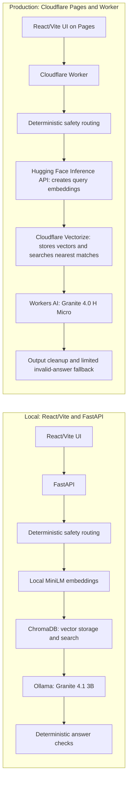
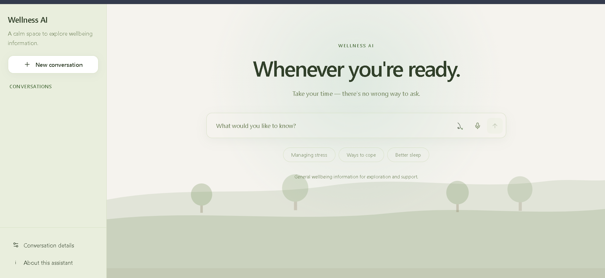
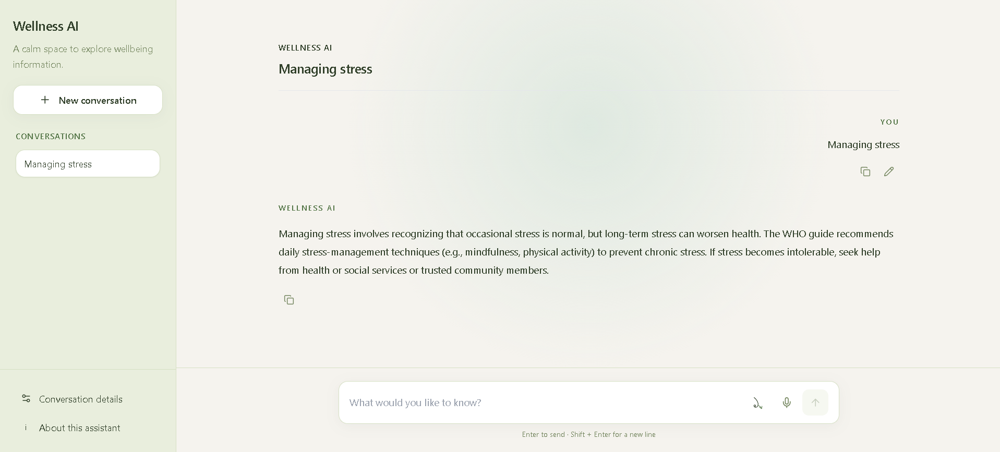
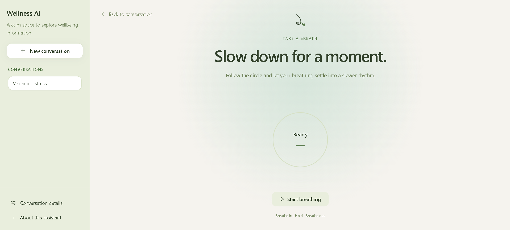
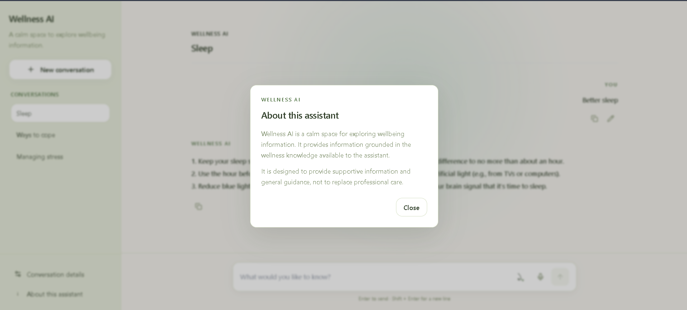

# Wellness AI

> **A Safety-Aware, Evidence-Grounded AI Assistant for Mental Well-Being**

Wellness AI is a responsible AI prototype designed to make general well-being information more accessible, understandable, and evidence-grounded.

It combines **Retrieval-Augmented Generation (RAG)**, **deterministic safety routing**, **evidence extraction**, and **conversation history** in a full-stack web application. Local generation uses IBM Granite 4.1 3B through Ollama; production generation uses Cloudflare Workers AI `@cf/ibm-granite/granite-4.0-h-micro`.

> **Important:** Wellness AI is an informational/supportive prototype. It is not a medical diagnostic system, therapist, or emergency service.

---

## SDG Alignment

**Primary SDG: SDG 3 - Good Health and Well-Being**

The project explores how responsible AI can support access to understandable general well-being information while incorporating safety and evidence-grounding mechanisms.

---

## Problem

People increasingly use online sources and generative AI for information about stress, emotional well-being, and everyday health concerns.

However, general-purpose AI systems can produce fluent but unsupported responses and may not reliably handle sensitive situations.

Wellness AI addresses this challenge by combining:

* Evidence retrieval
* Evidence extraction
* Grounded generation
* Deterministic safety routing
* Selective conversational history
* Controlled evaluation

Rather than relying solely on free-form generation, the system separates safety decisions, retrieval, evidence processing, and response generation into distinct stages.

---

## Solution

Wellness AI follows a controlled pipeline:

1. A user submits a question through the web interface.
2. A **deterministic safety layer** checks for sensitive scenarios.
3. Safe/normal queries enter the retrieval pipeline.
4. Relevant information is retrieved from a curated knowledge base.
5. Evidence is extracted and prepared for generation.
6. An evidence gate determines whether sufficient supported information is available.
7. The environment's configured Granite model generates the response using the permitted context.
8. Local context selection and production follow-up detection enrich retrieval with relevant conversation history. Production also passes the active conversation history to generation.

This architecture is designed to reduce unsupported generation while preserving useful conversational context.

---

## How It Works

### System Architecture


```mermaid
flowchart LR
  subgraph local["Local: React/Vite and FastAPI"]
    LUI["React/Vite UI"] --> LAPI["FastAPI"] --> LSAFE["Deterministic safety routing"]
    LSAFE --> LEMBED["Local MiniLM embeddings"] --> LCHROMA["ChromaDB: vector storage and search"]
    LCHROMA --> LGEN["Ollama: Granite 4.1 3B"]
    LGEN --> LVALID["Deterministic answer checks"]
  end
  subgraph production["Production: Cloudflare Pages and Worker"]
    PUI["React/Vite UI on Pages"] --> PWORKER["Cloudflare Worker"] --> PSAFE["Deterministic safety routing"]
    PSAFE --> PHF["Hugging Face Inference API: creates query embeddings"] --> PVEC["Cloudflare Vectorize: stores vectors and searches nearest matches"]
    PVEC --> PGEN["Workers AI: Granite 4.0 H Micro"]
    PGEN --> PVALID["Output cleanup and limited invalid-answer fallback"]
  end
```

Both paths use safety routing, retrieval, evidence checks, and generation, with different implementations and history policies. Hugging Face creates production query embeddings; Vectorize stores and searches vectors. Vectorize does not create embeddings.

### End-to-End Query Pipeline


```mermaid
flowchart TD
  subgraph localflow["Local query pipeline"]
    LQ["Current question and active-chat history"] --> LS["Safety routing"]
    LS -->|Sensitive| LSR["Pre-written safety response"]
    LS -->|Normal| LH["Select recent turns and semantically relevant older turns"]
    LH --> LRQ["Build retrieval query"] --> LE["MiniLM embedding"] --> LC["ChromaDB search"]
    LC --> LD["Select up to 3 chunks, max 1 per source"] --> LX["Extract supported evidence"] --> LGATE{"Evidence sufficient?"}
    LGATE -->|No| LFB["Knowledge-base fallback"]
    LGATE -->|Yes| LPROMPT["Prompt with selected conversation context"] --> LGEN["Ollama / Granite 4.1 3B"] --> LVAL["Check personal diagnosis, selected expansions, and evidence overlap"]
    LVAL --> LO["Answer with sources"]
  end
  subgraph prodflow["Production query pipeline"]
    PQ["Current question and active-chat history"] --> PS["Safety routing"]
    PS -->|Sensitive| PSR["Pre-written safety response"]
    PS -->|Normal| PF{"Follow-up pattern detected?"}
    PF -->|Yes| PLAST["Prefix latest previous user message to retrieval query"]
    PF -->|No| PCURRENT["Use current question for retrieval"]
    PLAST --> PHF["Hugging Face Inference API embedding"]
    PCURRENT --> PHF
    PHF --> PV["Vectorize search: 10 candidates, up to 3 diverse sources"] --> PEX["Extract supported evidence"] --> PGATE{"Evidence sufficient?"}
    PGATE -->|No| PFB["Knowledge-base fallback"]
    PGATE -->|Yes| PGEN["Workers AI / Granite 4.0 H Micro"] --> POUT["Clean labels and selected meta/empty outputs; limited evidence fallback"] --> PO["Answer with sources"]
    PHIST["Full supplied conversation history"] -. "generation context" .-> PGEN
  end
```

Local validation applies deterministic diagnostic and evidence-overlap heuristics after generation. Production performs output cleanup and limited empty/meta-output handling; it does not run the same claim-level post-generation checks. Neither check is a comprehensive grounding verifier.

## Retrieval

The retrieval pipeline was evaluated experimentally rather than configured only through intuition.

### Configuration

* **Embedding model:** `sentence-transformers/all-MiniLM-L6-v2`
* **Vector database:** ChromaDB locally / Cloudflare Vectorize in production
* **Candidate pool:** 10
* **Final context:** 3 chunks
* **Maximum chunks per source:** 1
* **Similarity metric:** cosine

### Final Retrieval Results

| Metric          |    Result |
| --------------- | --------: |
| Top-1 retrieval | **67.5%** |
| Top-3 retrieval | **97.5%** |

The source-diversity constraint improved Top-3 retrieval from **90.0% to 97.5%** without changing Top-1 performance.

This configuration was retained because the experiments showed a measurable improvement in evidence coverage without unnecessarily increasing the context size.

---

## Conversational Memory

The **local Python pipeline** uses selective history: it incorporates previous turns when they are useful for interpreting the current question, combining recent turns with semantically relevant older context.

Production uses a different policy. The Worker prefixes the latest previous user message to retrieval when its follow-up detector matches, and passes the supplied active conversation history to generation. The selective-history benchmark below measures the local retrieval strategies; it does not describe production history trimming.

For example:

```text
User: How can I manage daily stress?

User: What should I try first?
```

The second question can depend on the meaning established by the first turn.

### Evaluation

| Retrieval Strategy     |     Top-1 |    Top-3 |
| ---------------------- | --------: | -------: |
| Current question only  |     43.8% |    62.5% |
| Always include history |     62.5% |    75.0% |
| **Selective history**  | **75.0%** | **100%** |

Selective history improved retrieval over the current-question-only baseline by:

* **+31.2 percentage points Top-1**
* **+37.5 percentage points Top-3**

The evaluation also showed that indiscriminately including older history could introduce regression, which motivated the selective approach.

---

## Safety Architecture

Safety decisions are separated from normal generative processing.

The system uses deterministic routing for sensitive categories including:

* Crisis-related situations
* Medication-related queries
* Restrictive/eating-related queries
* Diagnostic uncertainty

The safety layer operates before normal retrieval and generation for applicable sensitive scenarios.

### Safety Evaluation

The local deterministic safety suite achieved:

**12/12 tests passed.**

Production testing additionally covered crisis, medication-restriction, restrictive-eating, normal well-being, unsupported requests, and topic-switching scenarios.

Safety decisions are based on the current user question rather than allowing unrelated historical context to override the current safety intent.

---

## Evidence & Grounding

A central design goal of Wellness AI is to reduce unsupported claims.

The generation pipeline separates retrieval, evidence validation, evidence extraction, and final response generation. Retrieval sufficiency is checked before generation, and evidence extraction provides a structured basis for supported claims. If sufficient supported evidence is not available, the system can terminate before generation rather than forcing an unsupported answer.

The final frozen generation evaluation achieved:

**18/20 successful evaluations - 90%.**

Among applicable grounding cases:

**The frozen summary reports 15/16 grounded - 93.75%.**

The committed row-level file `data/eval/generation_after_graded.csv` instead records 14 grounded, 2 ungrounded (IDs 14 and 19), and 4 N/A, which yields 14/16 applicable cases. This conflicts with the frozen summary's 15/16 and 3 N/A counts. No authoritative reconciliation is present, so both records are preserved and the discrepancy remains unresolved.

Two evaluations contained unsupported claims and were retained as known limitations rather than being hidden from the evaluation record.

---

## Key Features

* Evidence-grounded conversational responses
* Retrieval-Augmented Generation
* Deterministic safety routing
* Evidence extraction before generation
* Evidence gating
* Selective conversational history
* Follow-up question detection
* New conversations
* Conversation history
* Rename, pin, archive, and delete conversations
* Retry behavior
* Responsive React interface
* Guided breathing exercise
* FastAPI local backend
* Cloudflare Worker production API
* ChromaDB local retrieval
* Cloudflare Vectorize production retrieval

---

## AI Technologies

| Technology                           | Role                                             |
| ------------------------------------ | ------------------------------------------------ |
| **Local IBM Granite 4.1 3B / Ollama** | Local response generation                        |
| **Workers AI Granite 4.0 H Micro**  | Production response generation                  |
| **Retrieval-Augmented Generation**   | Grounds responses in retrieved information       |
| **Sentence Transformers**            | Semantic embeddings                              |
| **Hugging Face Inference API**       | Creates production query embeddings              |
| **ChromaDB**                         | Local vector database                            |
| **Cloudflare Vectorize**             | Production vector storage and nearest-neighbor search |
| **Deterministic Safety Layer**       | Routes sensitive scenarios                       |
| **Evidence Extraction**              | Converts retrieved material into usable evidence |
| **Selective Conversational History** | Preserves useful multi-turn context              |
| **Follow-up Detection**              | Identifies context-dependent questions           |

---

## Experiment-Driven Development

The system was developed through controlled experiments rather than continuously changing the pipeline without measurement.

Major experiments included:

* Retrieval model and configuration comparisons
* Candidate-pool and Top-K evaluation
* Source-diversity constraints
* Evidence extraction strategies
* Generation interventions
* Safety routing coverage
* Follow-up detection
* Selective versus always-on conversation history
* Production/local retrieval parity
* End-to-end production validation

Interventions that did not provide sufficient evidence of improvement were rejected or archived.

This helped maintain a controlled and reproducible system while preserving historical evaluation results.

---

## Final Evaluation

The final evaluation covered retrieval, safety, generation, conversation behavior, and production end-to-end behavior.

### Evaluation Methodology

The evaluation methodology, benchmark structure, metrics, and interpretation rules are documented separately.

[Read the full Evaluation Methodology](docs/evaluation/evaluation_methodology.md)

### Retrieval

* **Top-1:** 67.5%
* **Top-3:** 97.5%
* **Candidate pool:** 10
* **Final context:** 3 chunks
* **Maximum chunks per source:** 1

### Safety

* **Local deterministic safety suite:** 12/12 PASS
* Production safety scenarios validated across crisis, medication, restrictive-eating, and normal queries.

### Generation

* **18/20 successful evaluations**
* **90% final generation success**
* **20/20 appropriate tone**
* **20/20 diagnostic-label avoidance**

### Grounding

* Frozen summary headline: **15/16 (93.75%)**
* Row-level grading file: **14/16** (14 grounded, 2 ungrounded, 4 N/A)
* The discrepancy is unresolved; the frozen headline is retained without claiming the row-level count agrees.

Two unsupported-claim failures remained and are documented as known limitations.

### Follow-Up Detection

* **92% overall**
* **100% follow-up detection** on the final follow-up subset
* **100% standalone detection**
* **100% ambiguous-case detection**

### Selective History

* **75.0% Top-1**
* **100% Top-3**
* **+31.2 pp Top-1** over current-only history
* **+37.5 pp Top-3** over current-only history

### Production End-to-End

The final evaluation documentation records:

**12/12 PASS**

The previously documented context-dependent follow-up was re-tested successfully for the exact documented interaction. This resolves that tested case; it does not establish exhaustive coverage of other follow-up patterns.

> These are internal prototype evaluation results. They do not represent clinical validation, medical accuracy certification, or real-world health outcomes.

---

## Evaluation Philosophy

The project preserves historical evaluation results rather than rewriting earlier benchmarks after later improvements.

When an issue is discovered after an evaluation freeze:

```text
Identify
   ?
Classify
   ?
Track in owning phase
   ?
Finish current phase
   ?
Return to owning phase
   ?
Resolve
   ?
Re-test
   ?
Re-freeze
   ?
Final acceptance
```

This allows the project to distinguish between:

* **Frozen historical results**
* **Post-freeze fixes**
* **Current final behavior**

This distinction is important for maintaining reproducibility and honest reporting.

---

## Responsible AI

Wellness AI was designed with responsible AI considerations as core engineering requirements.

### Safety

Sensitive scenarios are handled through deterministic routing before normal generative processing.

### Transparency

The retrieval, evidence extraction, and evidence-gating stages provide mechanisms for grounding responses in retrieved information.

### Fairness

The system is designed to avoid demographic assumptions and discriminatory responses.

### Privacy

The prototype avoids unnecessary collection of personal or sensitive information.

### Human Oversight

Wellness AI is designed as an informational/supportive system rather than an autonomous medical decision-maker.

### Limitations

The system should not be treated as a replacement for qualified medical, psychological, or emergency support.

---

## Known Limitations

The project has several known limitations that remain important for future development.

### 1. Retrieval Top-1 Performance

Top-1 retrieval accuracy is **67.5%**, while Top-3 reaches **97.5%**.

This indicates that the correct evidence is usually present within the candidate context, but the highest-ranked result is not always the best individual source.

### 2. Follow-Up Coverage

The previously documented follow-up scenario was re-tested successfully in production. Other context-dependent phrasings have not been exhaustively evaluated and may still reach the evidence fallback:

```text
NO_SUPPORTED_EVIDENCE
```

even when the conversation context provides useful meaning.

The current evidence gate was deliberately not weakened to force an answer without sufficient retrieved evidence.

### 3. Unsupported Generation Claims

Two final-generation evaluations contained unsupported claims.

These remain documented as generation/grounding limitations rather than being removed from the evaluation set.

### 4. Safety Coverage

The established deterministic safety suite passed 12/12 cases. During the Phase 7 release audit, an additional restrictive-eating paraphrase gap was identified outside that frozen benchmark, fixed in the safety routing implementation, and covered by additional regression tests (local 8/8 restrictive/eating detection; production safety 17/17; full Worker suite 26/26). Broader paraphrase and adversarial testing remains a general future evaluation area.

### 5. Knowledge Base Dependence

Response quality depends partly on the quality, coverage, and diversity of the underlying knowledge base.

### 6. Prototype Scope

The system has not undergone clinical validation or large-scale real-world user testing.

---

## Screenshots

### Main Interface



### AI Conversation



### Breathing Exercise



### Responsible Use / About Assistant



---

## Project Structure

```text
PROJECT/
+-- Archive/
+-- data/
|   +-- eval/
+-- deployment_experiments/
+-- docs/
+-- Evaluation/
+-- Tests/
+-- Tools/
+-- cloudflare-deployment/
|   +-- src/ (Worker modules)
|   +-- tests/
|   +-- wrangler.jsonc
+-- wellness_ai_frontend_phase3B/
|   +-- wellness_ai_frontend/
+-- api.py
+-- query_pipeline.py
+-- rag_config.py
+-- safety_layer.py
+-- requirements.txt
+-- requirements.freeze.txt
```

Evaluation artifacts and archived experiments are kept separate from active application code.

---

## Local Setup

### Requirements

* Python 3.14+
* Node.js / npm
* Ollama
* IBM Granite 4.1 3B
* Project dependencies from `requirements.txt`

### 1. Install Python Dependencies

```powershell
pip install -r requirements.txt
```

### 2. Start Ollama

Make sure Ollama is installed and the required model is available:

```powershell
ollama list
```

The project currently uses:

```text
granite4.1:3b
```

### 3. Start the FastAPI Backend

From the project root:

```powershell
python -m uvicorn api:app --host 127.0.0.1 --port 8000
```

### 4. Start the Frontend

```powershell
cd wellness_ai_frontend_phase3B\wellness_ai_frontend

npm install
npm run dev
```

For local development, configure:

```text
VITE_API_BASE_URL=http://127.0.0.1:8000
```

Cloudflare bindings and the Vectorize index name are public deployment configuration in `wrangler.jsonc`. Credentials such as `HF_TOKEN` are supplied as Cloudflare secrets and are not committed.

---

## Production Deployment

The production implementation uses Cloudflare:

| Component         | Technology           |
| ----------------- | -------------------- |
| Frontend          | Cloudflare Pages     |
| API               | Cloudflare Workers   |
| Embedding service | Hugging Face Inference API (`all-MiniLM-L6-v2`) |
| Vector database   | Cloudflare Vectorize (stores and searches vectors) |
| Generation model  | Workers AI `@cf/ibm-granite/granite-4.0-h-micro` |
| Vector dimensions | 384                  |
| Similarity metric | Cosine               |

### Production Endpoints

**Frontend:**
https://deployment-free.wellness-ai.pages.dev

**API:**
https://wellness-ai-api.deswalgeetika.workers.dev

The production Vectorize index contains the validated knowledge-base vectors used by the deployed retrieval pipeline.

Local and production embedding outputs were also validated for parity, with cosine similarity approximately **0.9999999999998** and maximum absolute difference approximately **9.31e-8**.

Production retrieval matched the final evaluated retrieval configuration:

* **Top-1:** 67.5%
* **Top-3:** 97.5%

---

## Demo

**Live Demo:**
https://deployment-free.wellness-ai.pages.dev

The application can be evaluated through the deployed interface.

### Suggested Demo Flow

1. Ask a normal well-being question.
2. Ask a context-dependent follow-up.
3. Switch topics and demonstrate history isolation.
4. Test a sensitive safety scenario.
5. Try an unsupported request.
6. Demonstrate retry behavior.
7. Explore the breathing exercise.
8. Open the Responsible Use / About section.

---

## Demo Assets

Additional presentation and demonstration assets can be added as the project moves through the final documentation and release stages.

---

## Future Scope

Potential future improvements include:

* Broader and more rigorously curated knowledge sources
* Expanded safety and adversarial evaluation
* Improved follow-up/evidence-gate handling
* Larger-scale user testing
* More comprehensive multilingual support
* Improved observability and deployment monitoring
* Further evaluation of retrieval and model alternatives
* Privacy-preserving analytics for system improvement

Future work should preserve the project's safety, evidence-grounding, and evaluation principles.

---

## Disclaimer

Wellness AI provides general informational/supportive responses.

It does **not**:

* Diagnose medical or psychological conditions
* Replace professional healthcare
* Provide emergency services
* Guarantee medically accurate or clinically validated outcomes

For urgent or emergency situations, users should contact appropriate local emergency or professional support services.

---

## Community and Security

- [MIT License](LICENSE)
- [Code of Conduct](CODE_OF_CONDUCT.md)
- [Contributing](CONTRIBUTING.md)
- [Security Policy](SECURITY.md)
- [Report a bug](.github/ISSUE_TEMPLATE/bug_report.yml) or [request a feature](.github/ISSUE_TEMPLATE/feature_request.yml)

The MIT License applies to project materials owned by the repository contributors. Third-party dependencies, datasets, and models remain under their own terms.

---

## Project

**Wellness AI - A Safety-Aware, Evidence-Grounded AI Assistant for Mental Well-Being**

**Primary SDG:** SDG 3 - Good Health and Well-Being

Built as an AI application exploring responsible use of:

**RAG | IBM Granite | Evidence Grounding | Deterministic Safety | Conversational AI | Cloudflare**
